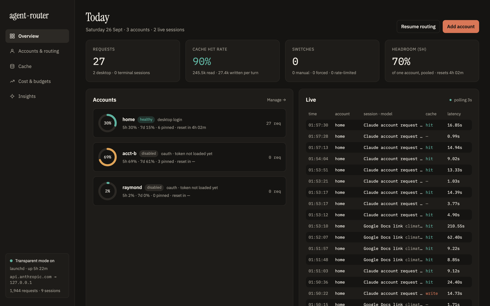
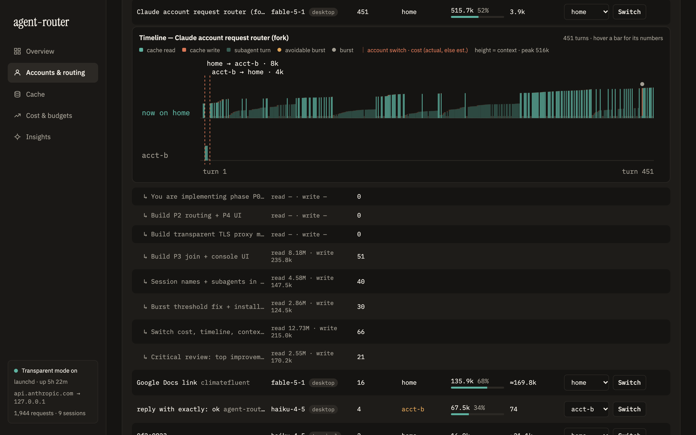
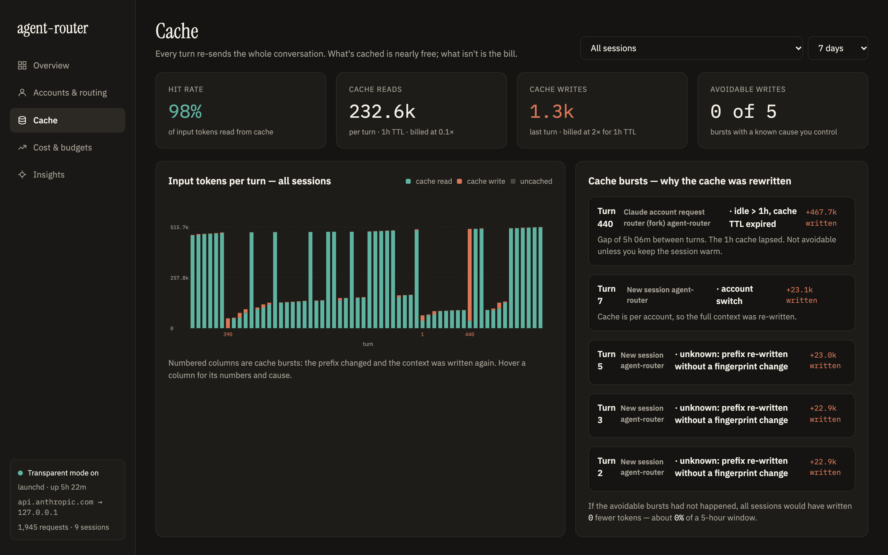
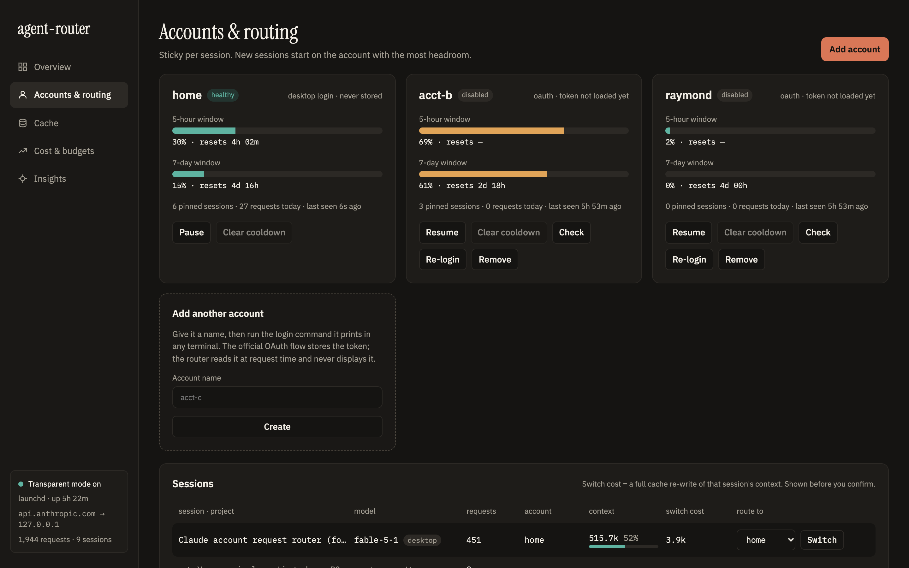
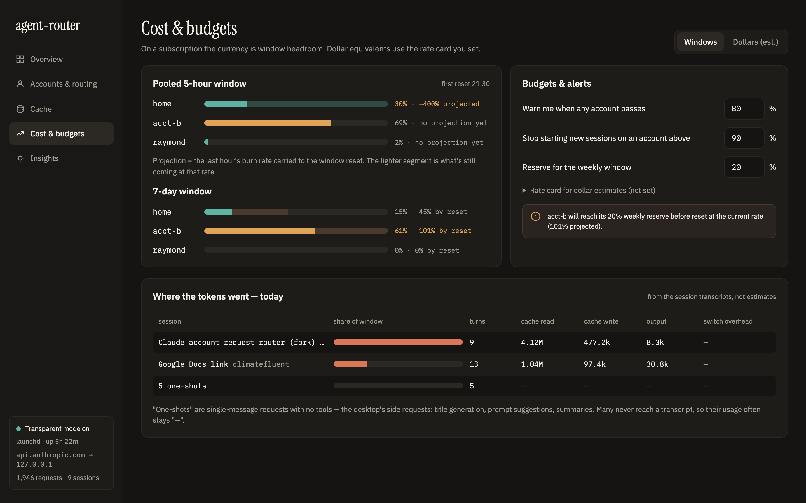
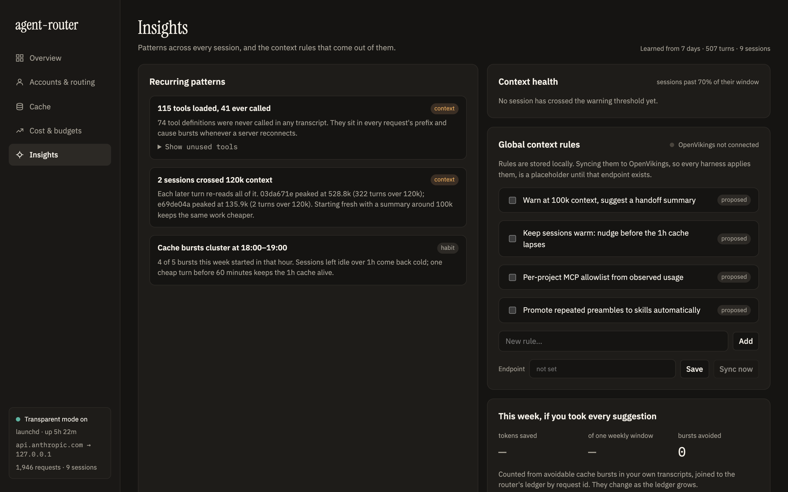

# agent-router



A local proxy for Claude Code that routes each session to one of several Claude accounts, keeps prompt caches warm,
and shows you where your tokens go. Works with the Claude desktop app (transparent mode) and the terminal CLI.
Zero dependencies: Node 24 + SQLite (built in) + `openssl`.

**Status:** early, macOS first (Linux/Windows via CLI-only mode below). Use it with subscriptions **you own** — it is
not a way to share one account between people. MIT licensed.

- **Sticky routing.** A session stays on one account (its cache lives there). New sessions start on the account with
  the most headroom. Rate-limited → cooldown, replay on another account, logged. A session whose account passes 95% of a
  window moves to one with more headroom *before* it gets rate-limited, and every switch posts a macOS notification.
- **Ledger.** Every request joined to your session transcripts by request id: cache read/write per turn, every cache
  re-write with its cause and its cost, per-window headroom, per-session cost in dollars at list price.
- **Console** at `http://localhost:4001/router/`: accounts, sessions (switch with one click), cache manager, budgets, and
  insights: a ranked list of where the money went, each with the setting or command that fixes it.
- **Brain** (optional, off by default). Plain Markdown notes about your past sessions, and skills extracted from them, so the
  next session looks things up instead of working them out again.


## What it looks like

| Session timeline — which account each turn ran on, and what every switch cost | Cache manager — bursts and why they happened |
| --- | --- |
|  |  |

| Accounts & routing — headroom per window, one-click switch | Cost & budgets — pooled windows, thresholds, per-session share |
| --- | --- |
|  |  |

| Insights — unused tools, oversized contexts, when bursts happen |
| --- |
|  |

## Setup (macOS)

**Homebrew** (run `brew update` first if your Homebrew is older than 4.x):

```bash
brew tap yp201/tap && brew install agent-router && brew services start agent-router && agent-router install
```

**Plain Node** (any Node 24+, no Homebrew):

```bash
git clone https://github.com/yp201/agent-router.git && cd agent-router && ./agent-router.sh install
```

Both do the same thing; pick whichever you prefer. Upgrading: `brew upgrade agent-router` or `git pull && ./agent-router.sh restart`. Releases: `docs/RELEASING.md`.

It checks for Node 24, generates a local CA, asks for `sudo` twice (trust the CA, point `api.anthropic.com` at this
machine), registers the router with launchd so it's always on, and health-checks itself. Then **quit and reopen the
Claude desktop app**. Open `http://localhost:4001/router/`.

What you are agreeing to: every process on this Mac that talks to `api.anthropic.com` now goes through a proxy you run,
and trusts a CA generated on this machine. `./agent-router.sh uninstall` reverses all of it.

## Add a second account

Console → **Add account** → run the command it prints in any terminal (it opens the official login in your browser) →
**Check**. New sessions will start on whichever account has the most headroom; live sessions stay where they are unless
you switch them.

```bash
CLAUDE_CONFIG_DIR=~/.agent-router/accounts/<name> claude auth login
```

## Context advisor

When a session's context first passes 70% of its window (85% again as "urgent"), the router reads that session's transcript
locally, sizes what fills it — biggest tool results, files read more than once, tokens per tool — and asks Haiku, through
your own `claude` CLI, for the three biggest avoidable items and whether to hand off now. You get a macOS notification and an
advice card under the session in the console, with a **Write handoff summary** button that drafts a summary to paste into a
fresh session. Only tool names, targets and sizes are stored, never tool output. Thresholds, per-model windows and the model
live in settings (`context_warn_pct`, `context_urgent_pct`, `context_windows`, `advisor_model`, `advisor_enabled`); `NOTIFY=0` mutes it.

## Budgets

A budget is a spend limit over a scope (everything, one project, one account, or every session individually) and a period
(day = since local midnight, week = the last 7×24 h, rolling, or the session's whole life). Add them in the console under
**Cost & budgets**, or `PUT /router/settings` with `budgets: [...]`. There are none until you add one.

- **Unit:** dollars at list price. Each request is priced from a built-in table of Anthropic's published rates (input, 5-minute
  and 1-hour cache writes, cache reads, output, per model; the console shows the table and its as-of date), and `rate_card`
  overrides a model's rates. On a subscription this is an equivalent, not a bill. A model that is not in the table has no price:
  its requests are counted as "unpriced" and left out of every sum, never guessed. Usage is read from each response as it
  streams through, so spend is current to the last request.
- **Or a share of a window:** `"unit": "pct_7d"` (or `"pct_5h"`) makes `limit` percentage points of one account's weekly (or
  5-hour) window, e.g. "this project may take 10% of home's week". It needs `scope: "account"` (or `all` while there is a single
  account) and is converted from dollars at that account's measured rate (see *Limits as the unit*). Until there is a rate the
  budget shows "waiting for data" and never fires.
- **notify** posts one macOS notification the first time the budget passes 80% and 100% in a period.
- **stop** also refuses further `/v1/messages` requests in that scope once it is at 100%: Claude Code shows
  `API Error: 400 agent-router budget ‘…’ is spent: $20.14 of $20.00 at list price today. It resets Fri 00:00. Raise or remove it at http://localhost:4001/router/#cost`
  and ends the turn (no retries). Raise or delete the budget to continue. Token counting and other endpoints are never blocked.

```bash
# $20 a day for one project (notify), and a $50 cap on any single session (stop: the runaway-agent guard)
curl -X PUT localhost:4001/router/settings -d '{"budgets": [
  {"id": "cf-day", "name": "climatefluent / day", "scope": "project", "match": "climatefluent", "period": "day", "limit": 20, "action": "notify", "thresholds": [0.8, 1]},
  {"id": "cap", "name": "per-session cap", "scope": "session", "match": null, "period": "session", "limit": 50, "action": "stop", "thresholds": [0.8, 1]}]}'
```

A project is the basename of the session's working directory, known once the session's transcript has been read: the first
request or two of a brand-new session are not counted against (or stopped by) a project budget.

## Insights

The Insights tab (and `./agent-router.sh report`) ranks what cost money in the last 7 days. Every figure is arithmetic over the
ledger and your transcripts at list prices; no model is asked for any of it.

**Exact, and no change in what the model does** (chip: *no quality change*):

- **Why each cache re-write happened and what it cost.** The router fingerprints what Claude Code's cache key depends on
  (model, effort, fast mode, the loaded tool set, the system prompt, image count, CLI version; hashes and counts only) and names
  the cause: a model switch, fast mode turned on, an effort change on a model where that re-writes, a changed tool set. Compaction
  and clearing are shown as expected rebuilds, not misses.
- **Going cold.** A macOS notification five minutes before a large 1-hour cache lapses, with what a message costs now and what
  the next turn costs after (`cold_warn`, `cold_min_context`, `cold_min_usd`, `cold_lead_min`). The router sends nothing upstream
  (unless you turn on *Keep warm*, below; a session it is keeping warm gets a ping instead of this warning).
- **Cache lifetime fit.** Your real pauses replayed under a 5-minute and a 1-hour cache, per bucket. It names `promptCacheTtl` or
  `subagentPromptCacheTtl` only when the other lifetime would have saved at least 5% and $1.
- **Carrying cost.** Each tool result's size × the turns that re-read it × the read price: the ten costliest, and the top five
  per session in its timeline. Names, targets and sizes only, never the output.
- **Gateway check.** Sessions that load every tool definition because tool search is off (see the CLI-only section below).

**Exact arithmetic, quality not measured:**

- **Model what-if** (chip: *unverified*). The same tokens at every other model's price, and for one session what switching now
  costs (the one-time cache re-write) and how many turns it takes to pay back. Nothing here tells whether the cheaper model
  would have done the work as well; it says so on every such number.
- **Safe switches.** A newer, cheaper model of the same family (*no quality change* expected), and subagent runs that only read
  files or the web on a model above Haiku (*docs-recommended*: the Claude Code costs doc suggests `model: haiku` for those).

Design, sources and what was left out: `docs/COST-INSIGHTS.md`.

## Limits as the unit

On a subscription the scarce thing is the 5-hour and the weekly window, not dollars. Every response carries the account's
utilization, so the router measures the exchange rate from its own traffic: list-price dollars spent between two readings ÷
the points the window moved, per account, over the last 14 days (`GET /router/limits`; Cost tab, "What a dollar is in windows").

Wherever the console shows a dollar figure that one account paid for — findings, cache re-writes, a session's rebuild cost,
budgets, the Cost tab, the model what-if, `./agent-router.sh report`, the going-cold notification — it adds
`≈ 4.6% of your 5-hour window · 0.8% of your week`. A figure spanning accounts uses the account that paid most.

- Shown only once an account has moved a window by at least 3 points on router traffic. Under $20 or 10 points of evidence the
  phrase ends in `(rough)`.
- Also `(rough)` when the latest window moved more than three times as far per dollar as the account's own median: the account
  is being used somewhere the router does not see (another machine, claude.ai), so its windows fill faster than this says.
- It is an estimate from list prices; Anthropic does not publish how usage is weighted.

## Keep warm

Off by default (`warm_enabled`; Cost & budgets → Keep warm). A prompt cache's lifetime restarts every time it is read, so
replaying a session's last request shortly before the hour is up keeps a large context warm: the next message then costs a
cache read instead of a full re-write. On Opus 5.5 one rebuild costs as much as 40 pings (about 37 hours of warming), on
Fable 5.1 80, on Sonnet 5.5 20.

Three things to know before turning it on:

1. **The router sends requests on its own, with your login.** A ping is the session's last request, replayed unchanged; the
   router hangs up as soon as the response starts. Pings count toward your limits and are logged with source `warm`.
2. **The last request of each large session is held in memory only** (raw bytes and headers, at most 20 sessions and 64 MB):
   never written to disk, the ledger or the log, and gone when the router restarts. Nothing is held while keep-warm is off.
3. **The desktop login (home) is only refreshed while the app is in use.** Warming a home session overnight can stop with
   "the desktop app's login expired"; it resumes when the session next sends a request.

What gets pinged: sessions you pick (Sessions → *Keep warm* 1h / 2h / 4h / until I'm back, which first shows the ping and the
rebuild cost in dollars and in % of your windows, the pings needed and the break-even), sessions matching a rule
(`warm_rules`: "on weekdays 12:30–14:00 keep every session warm"), and, with `warm_after_stop_hours`, any session for that
long after its last message. Rules and after-stop only cover sessions whose rebuild would cost at least `warm_min_usd` ($1).
One ping goes out `warm_lead_min` (5) minutes before the cache would lapse. Only 1-hour caches: a 5-minute cache never pays back.

It stops by itself, and says why: the session became active again (the clock just restarts), the time or the rule's window is
over, `warm_max_hours` (8, at most 24) after the session's last request, `warm_daily_usd` ($2) is spent, the account is past
`warn_pct` on either window, the account is cooling, disabled or needs a login, a ping failed (one failure stops that session
until its next request), or the router restarted. A failed ping never cools an account or moves a session.
`GET /router/warm` lists settings, today's spend, covered sessions with their next ping, and recent pings.

## Tool loading

Claude Code defers MCP tools behind tool search; a server with `"alwaysLoad": true` loads upfront. The Insights tab's **Tools**
panel (`GET /router/tools?days=30&project=`) reads your own ledger — calls per server, the sessions that used it, `ToolSearch`
round trips, definition sizes — and says, per project or overall:

- **Always load** a server called in at least half of the sessions (4 or more) that is deferred now, when the search round
  trips it would save (each one re-reads the whole prefix) cost more than carrying its definitions on every turn. Both numbers
  are shown. If the server is defined in a file you own (`~/.claude.json` or the project's `.mcp.json`) the panel names the entry
  to add `"alwaysLoad": true` to; for a plugin's or a claude.ai connector's server the flag cannot be set, and it says so.
- **Disable** a server not called in 30 days: deferred, it still costs its tool names in every request; loaded, its definitions.
  `claude mcp remove <name>` or the `/mcp` toggle.
- **Leave deferred** everything else, and where tool search is off (a custom base URL does that) the `ENABLE_TOOL_SEARCH` fix.

The router changes nothing: it never edits your config and never rewrites the tool list of a request. Only the names under
`mcpServers` are read from your config files. Built-in tools are listed for information.

## Brain

Off until you enable it in the console's **Brain** tab (or `PUT /router/settings {"brain_enabled": true}`). It writes plain
Markdown into one folder, `~/agent-router-brain` by default (`brain_dir`), laid out so it opens as an Obsidian vault:

```
_CLAUDE.md  index.md  CRITICAL_FACTS.md  log.md
wiki/logs/       one note per session: what you asked, files written, commands that worked, tools, subagents, account switches
wiki/projects/   one note per project: dated decisions, learnings and open threads, plus its sessions
wiki/daily/      one note per day: sessions and spend
skills/          one note per skill (status, the session and project it came from, uses);  skills/candidates/<name>/SKILL.md  awaiting your review
```

- **Capture is free.** A session that has been idle for 15 minutes gets its note straight from its transcript; no model is
  called. One-shots (fewer than 2 typed prompts and fewer than 3 tool calls) get no note. Prompts are cut to 300 characters, commands to 200, obvious secrets (API keys, bearer tokens, `password=`, private
  keys) are redacted, tool output is never copied. Text you write outside the `<!-- agent-router:begin/end -->` markers is kept.
- **Distilling spends quota, and only when asked.** Click **Distill** on a session (or set `brain_distill` to `on_idle`). A
  classifier first decides whether the session is worth it: [TypeSafe's Jev](https://docs.typesafe.ai) if you have a key
  (`TYPESAFE_API_KEY` or `~/.agent-router/typesafe.key`), otherwise Haiku. Only then does Sonnet write the summary, the dated
  bullets for the project note and, when the session worked out a reusable procedure, a skill candidate. Both models run
  through your own `claude` CLI and this router; their requests are tagged, summed in dollars at list price like budgets, and
  stop at `brain_daily_usd` ($1 a day by default). Over the cap, work is queued for the next day.
- **Skills go candidate → promoted, by hand.** A candidate (extracted, or imported from an https URL to one `SKILL.md`) is just
  a file in the vault. **Promote** copies it to `~/.claude/skills/<name>/` with a marker file, so every new session loads it;
  a skill directory the router did not install is never overwritten. **Demote** removes it again, **Reject** deletes the
  candidate. The console counts each skill's uses from `Skill` tool calls in your transcripts and flags promoted skills
  unused for 30 days. No savings are claimed.
- **Critical facts.** `CRITICAL_FACTS.md` is yours to write. *Load in every session* (Notes → Facts) keeps one line,
  `@~/agent-router-brain/CRITICAL_FACTS.md`, in `~/.claude/CLAUDE.md`, so Claude Code injects the file into every session;
  switching it off removes exactly that line. It applies from the next session; Cowork sessions skip it. Keep the file short.
- **Recall.** *Install recall skill* adds a small `brain` skill that tells Claude to read the vault's index and at most three
  notes when you refer to past work.
- **Pipeline.** The Brain tab opens on a funnel — captured (no model) → scanned (Haiku looks for a repeatable skill) → extracted
  (Sonnet) → skill candidate → promoted — with one row per session showing how far it got and what each step cost. *Scan* runs
  only the classifier; *Scan backlog* and *Extract scanned* work through the rest in the background after a confirm that states
  the count, an estimate and what is left of the daily cap.
- **Graph.** An Obsidian-style graph of the vault drawn in the console (no Obsidian needed): sessions, projects, days, skills and
  tags, with a skill tied to the session it came from and the sessions that used it. The same links are written into the notes,
  so Obsidian shows the same picture; *Open in Obsidian* appears when the app is installed, *Reveal folder* otherwise.

Settings: `brain_enabled`, `brain_dir`, `brain_distill` (`manual` | `on_idle`), `brain_daily_usd`, `classifier`
(`auto` | `jev` | `model`), `brain_classifier_model` (`haiku`), `brain_writer_model` (`sonnet`), `brain_confidence` (0.7).
Design and the choices behind it: `docs/BRAIN.md`.

## Day to day

```bash
./agent-router.sh status     # one line per component
./agent-router.sh logs       # tail the router log
./agent-router.sh report     # the ranked cost findings for the last 7 days (report 30 for 30 days)
./agent-router.sh restart    # after pulling a new version
./agent-router.sh uninstall  # remove hosts entry, CA trust, launchd job
```

State lives in `~/.agent-router/` (ledger, certs, accounts, log); the checkout only holds code.

After a reboot everything comes back by itself. If the router is ever down, Claude can't reach the API — `status` tells
you in one line, `start` fixes it.

## Terminal CLI only (Linux, or macOS without the desktop app)

No sudo needed. Add to `~/.claude/settings.json`:

```json
{ "env": { "ANTHROPIC_BASE_URL": "http://127.0.0.1:4001", "ENABLE_TOOL_SEARCH": "true" } }
```

and run `node router.ts` (or the launchd/systemd job). `ENABLE_TOOL_SEARCH` matters: with a custom base URL Claude Code turns
tool search off, so every tool definition (68 here, about 34k tokens) loads into every request instead of about a dozen. Transparent mode is only required for the desktop app,
which ignores that setting.

## Development

```bash
node --test test_router.ts   # 46 tests, fake upstream, no network
```

`router.ts` proxy + routing · `accounts.ts` token store · `tailer.ts` transcript join · `console.ts` analytics · `advisor.ts` context advisor · `brain.ts` notes and skills ·
`ui.html` console · `agent-router.sh` install/status/uninstall. Plan and findings: `PLAN.md`, `NOTES.md`, `docs/`.

Tokens are read from the official CLI's credential store at request time; a refreshed token is written back to that same
store (the CLI's own) and never written to the ledger, logs or UI.
The ledger stores no request bodies — only hashes, counts and token totals. The optional brain, when you enable it, writes
excerpts of your own prompts and commands to a folder you choose.
